<h3 align="center">Calendly Clone</h3>

## Table of Contents

1. [Introduction](#introduction)
2. [Note](#note)
3. [Demo](#demo)
4. [Tech Stack](#tech-stack)
5. [Features](#features)
6. [Quick Start](#quick-start)
7. [What I learned](#learn)
8. [Implementation Notes](#implementation-notes)

## <a name="introduction">Introduction</a>

A full-stack Calendly clone allows you to create an availability schedule and events. And let other users book your time from a shareable profile and event link based on your availability schedule without conflict with events in Google Calendar.

## <a name="note">⚠️ Note</a>

This project was implemented based on a tutorial video on YouTube from freeCodeCamp [Build a Calendly Clone – Full Stack Next.js, Typescript, React, Tailwind](https://www.youtube.com/watch?v=cCuvlQvU1eg).

Good project idea, tech stack, folder structure, and many other good things that I'm not familiar with. But this one does not seem to be for beginners. Since code usually comeout of nowhere by copy and paste(Maybe ChatGPT) with no code styling at all(No `Prettier` or any code formatter or even manual code formatting) which mess up code indentation and screen will move up and down based on pasting code and then jump around give some code explanation and then continue to import missing module/functions/components and if that missing part is not implemented yet then continue to implement it and left current code not runnable until whole part is implemented which make it hard to debug in the end not like pair programming or TDD or normal way that you write code and test it step by step so you know current state of the part you are working on.

The code styling issue and screen jump cause me to lose track of code position and scope several times. And sometimes I can't see the entire code in the video, so for `ScheduleForm.tsx` and some other files, I need to copy some part of it from github repo instead. And I also got some issues about the timezone on business logic when running the project on `Vercel`, which makes me notice that there are some implementation issues. And for AI-generated code from video, there is also code that works but is not optimized, 3-level nested `return` in `getValidTimesFromSchedule()`, unnecessary nested 1-line function, etc. I only fix some of them, which can be seen in [Implementation Notes](#implementation-note) section. This project taught me to be more careful when relying more on AI.

## <a name="demo">Demo</a>

Click on each section to toggle the demo image.

<details>
  <summary>
    Authentication
  </summary>
  <b>Sign up</b>
  <div>
    <a href="">
        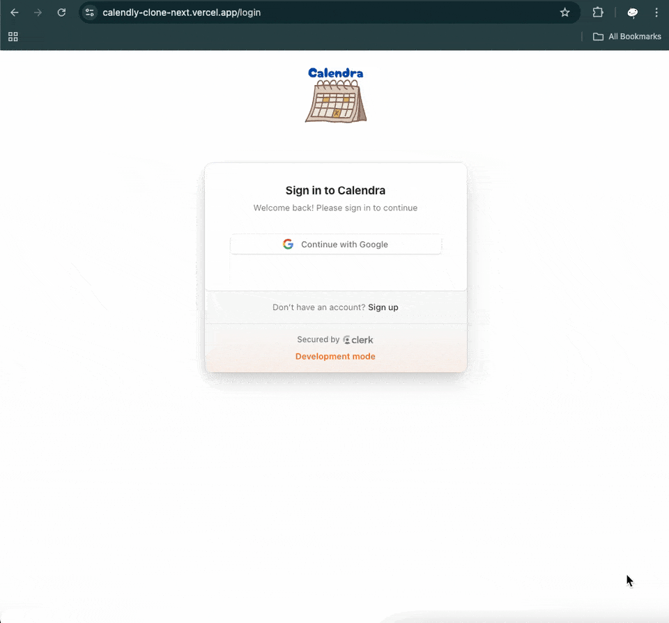
    </a>
  </div>
  <b>Sign in</b>
  <div>
    <a href="">
      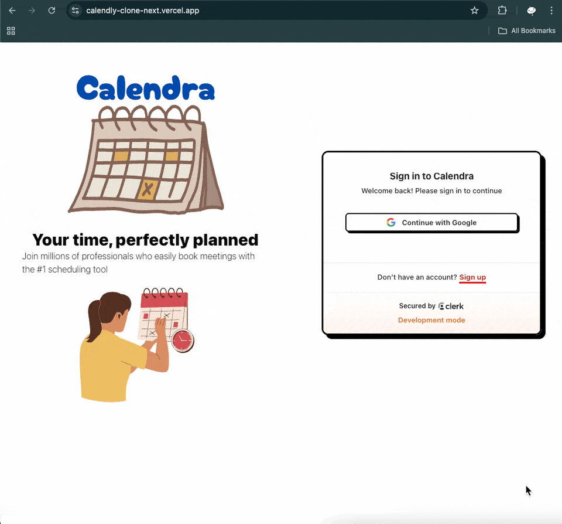
    </a>
  </div>
</details>
<details>
  <summary>
    Authenticated User
  </summary>
  <div>
    <b>Create Availability Schedule</b>
    <div>
      <a href="">
        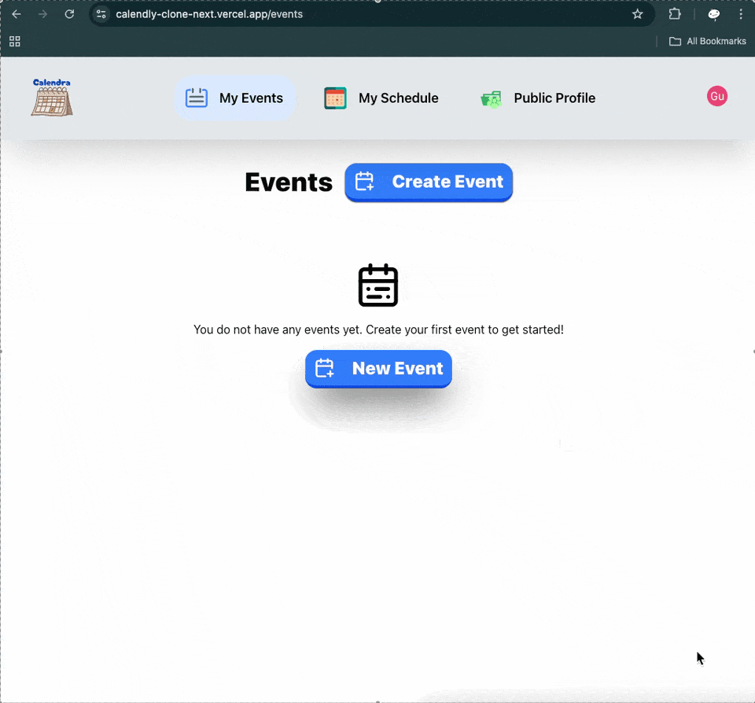
      </a>
    </div>
    <b>Create Active Event</b>
    <div>
      <a href="">
        
      </a>
    </div>
    <b>Create Inactive Event</b>
    <div>
      <a href="">
        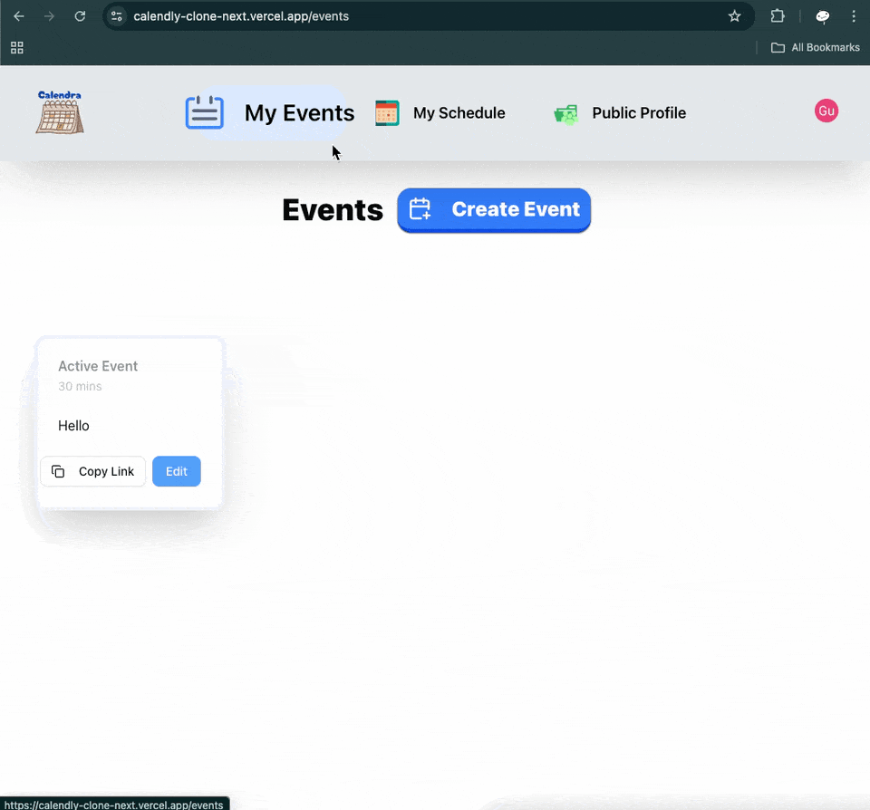
      </a>
    </div>
    <b>Edit Event</b>
    <div>
      <a href="">
        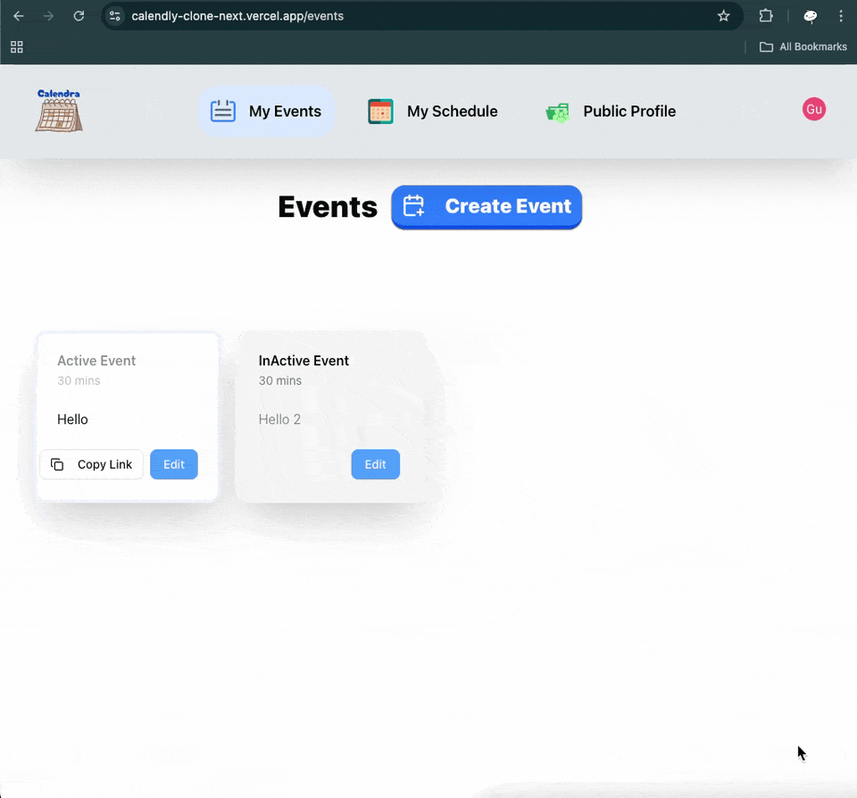
      </a>
    </div>
    <b>Delete Event</b>
    <div>
      <a href="">
        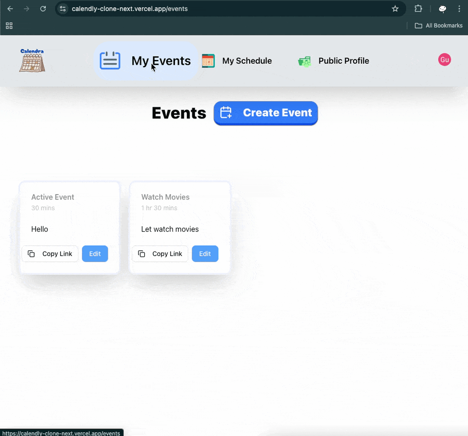
      </a>
    </div>
  </div>
</details>

<details>
  <summary>
    Non-Authenticated User
  </summary>
  <div>
    <b>See Public profile from Profile's Link</b>    
    <div>
      <a href="">
        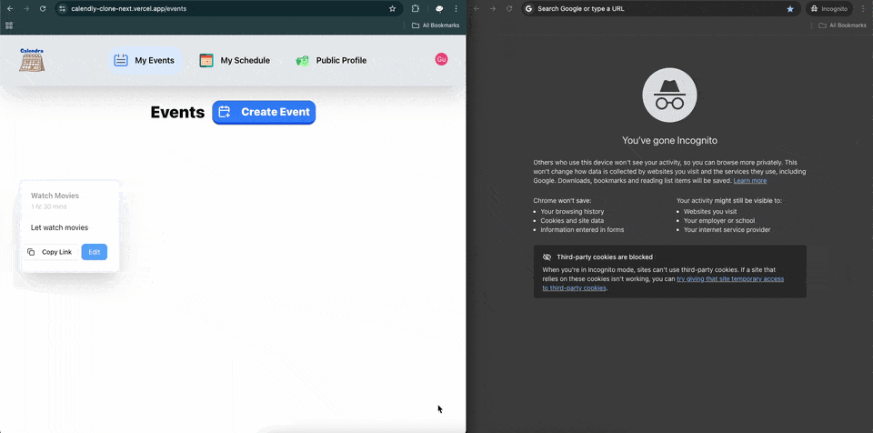
      </a>
    </div>
    <b>Booking Event from Event's link</b>
    <div>
      <a href="">
        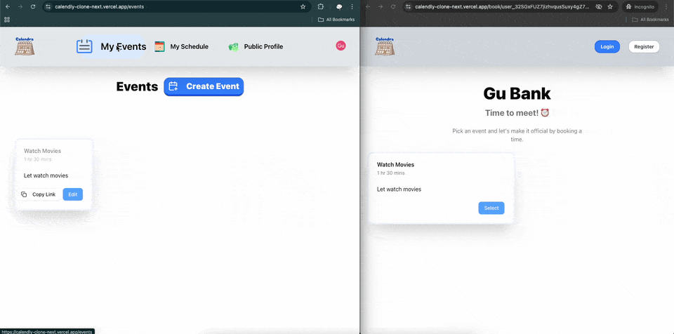
      </a>
    </div>
    <b>Invitation Email</b>
    <div>
      <a href="">
        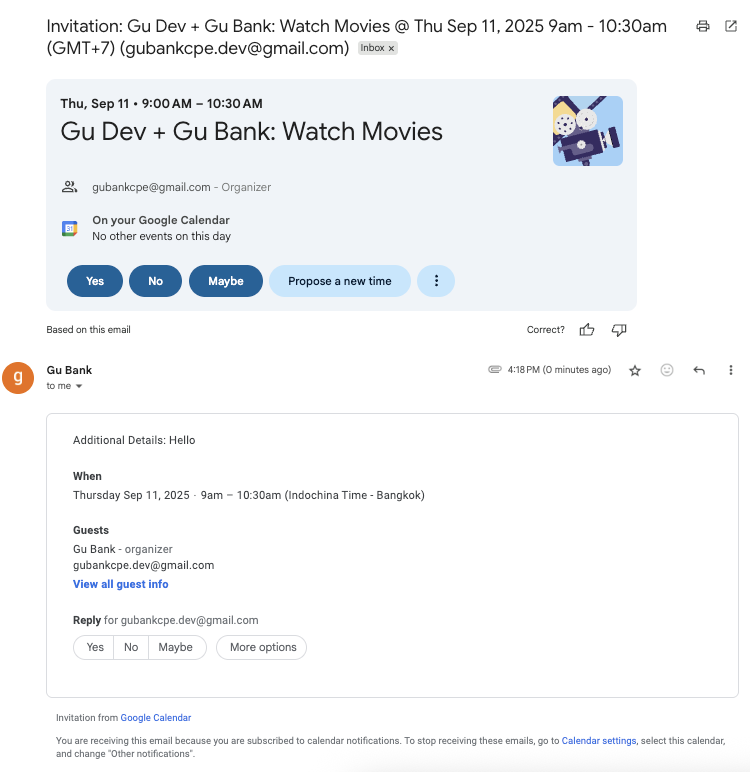
      </a>
    </div>
    <b>Google Calendar after accept invitation</b>
    <div>
      <a href="">
        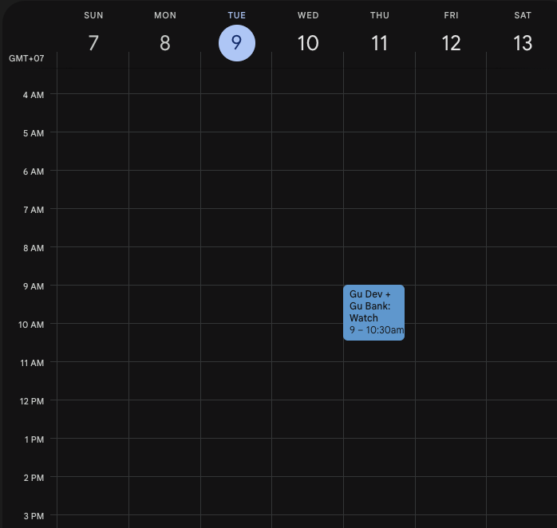
      </a>
    </div>
    <b>Available time slot will be updated according to events in Google Calendar</b>
    <div>
      <a href="">
        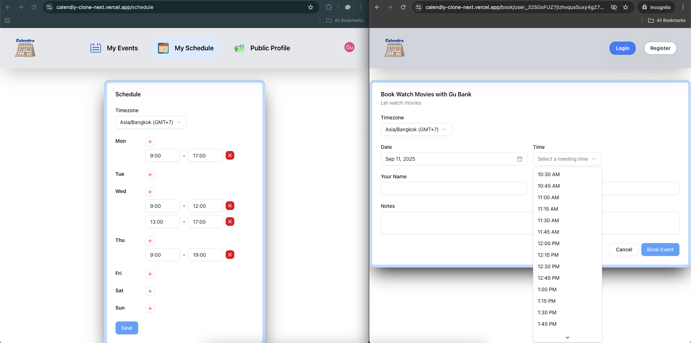
      </a>
    </div>
  </div>
</details>

## <a name="tech-stack">Tech Stack</a>

- Next.js - React framework for full-stack web application development
- React - JavaScript library
- TypeScript - JavaScript superset for type safety
- Tailwind CSS v4 - CSS framework
- Clerk - Authentication middleware, pre-built UI components for user authentication, and themes
- Neon - PostgreSQL database cloud service
- Drizzle - ORM for SQL databases
- Vercel - Cloud platform to host this project
- Shadcn UI - a components library that provides pre-built UI components code and lets you customize it. In this project, we use it for Button, Card, Form, Input, Textarea, Switch, AlertDialog, Sonner (Toast but different name), Select
- Lucide React - Icon library for React
- tw-animate-css - Collection of utility classes for Tailwind CSS animations
- react-hook-form - Custom React hook for form validation, form state management, and form submission
- Zod v4 - Schema-based validation and data parsing
- @hookform/resolvers - Form validation resolver when using an external validation library like `zod` in this project
- react-loading-indicators - Collection of React components for displaying loading state
- googleapis - Google APIs Node.js Client library to access Google Calendar APIs
- date-fns - Utility functions library for `Date` in JavaScript
- date-fns-tz - Time zone support functions for `date-fns`

## <a name="features">Features</a>

- Sign up/sign in with a Google Account
- Google Calendar Integration
- Timezone Support when creating an availability schedule and booking an event
- Create/Edit/Delete Event
- Shareable Profile and Event Link
- Responsive Design

## <a name="quick-start">Quick Start</a>

Follow these steps to set up the project locally on your machine.

### Prerequisites

- Git
- Node.js
- npm

### Cloning the Repository

```bash
git clone https://github.com/bank8426/calendly-clone-next.git
cd calendly-clone-next
```

### Installation

Go inside the backend folder and install the project dependencies using npm:

```bash
npm install
```

### Set Up Environment Variables

1. Create a new file named `.env` and copy the content inside `.env.example`
2. Replace the placeholder values with your actual credentials

```env
# create new clerk application https://clerk.com/
NEXT_PUBLIC_CLERK_PUBLISHABLE_KEY=
CLERK_SECRET_KEY=

NEXT_PUBLIC_CLERK_SIGN_IN_URL=/login
NEXT_PUBLIC_CLERK_SIGN_UP_URL=/register
NEXT_PUBLIC_CLERK_SIGN_IN_FORCE_REDIRECT_URL=/events
NEXT_PUBLIC_CLERK_SIGN_UP_FORCE_REDIRECT_URL=/events

# create new database https://neon.com/
DATABASE_URL=

# https://developers.google.com/workspace/calendar/api/quickstart/js
# search APIs & Services -> Google Calendar API https://console.cloud.google.com/
GOOGLE_OAUTH_CLIENT_ID=
GOOGLE_OAUTH_CLIENT_SECRET=
# create new clerk application https://clerk.com/
GOOGLE_OAUTH_REDIRECT_URL=
```

### Running the Project

```bash
npm run dev
```

Your server will run on [http://localhost:3000](http://localhost:3000/)

## <a name="learn">What I learned</a>

`JavaScript`

- `Object.groupBy` - is a method that lets you group an array of objects or an iterable thing by a callback function, similar to `_.groupBy` in `Lodash`. This method is available from `Node v21`. But since I am still using `Node v20`, it caused a `groupBy is not a function` error. So I need to update Node to the latest version to make it work. My bad🙈.

`JavaScript Web APIs`

- `navigator.clipboard.writeText("sometext")` - is a method that lets you copy text to the clipboard.

- `Intl.supportedValuesOf(key)` - is a method that lets you get a sorted array of supported values related to the `Intl` object (Internationalization) based on `key` parameter, which can be one of the following:

  - `calendar`: see supported calendar types
  - `collation`: see supported collation types
  - `currency`: see supported currency identifiers
  - `numberingSystem`: see supported numbering system types
  - `timeZone`: see supported time zone identifiers
  - `unit`: see supported unit identifiers

```js
//Example
console.log(Intl.supportedValuesOf("timeZone"));

//['Africa/Abidjan', 'Africa/Accra', 'Africa/Addis_Ababa', 'Africa/Algiers' ... , 'Pacific/Wallis']
```

`React`

- `useTransition` - is a `hook` that lets you track the pending state of an action(or async function) that is called in React. Just like when you manually handle loading state in React with `useEffect` and `useState`.

```js
//Example
const [isPending, startTransition] = useTransition();

return (
  <Form {...form}>
   ... // form fields
    <Button
      disabled={isPending}
      onClick={() => {
        startTransition(async () => {
          try {
            await deleteEvent(event.id);
            router.push("/events");
          } catch (error: any) {
            form.setError("root", {
            message: `There was an error deleting your event: ${error.message}`,
          });
        }
      })}}
    >
      Delete
    </Button>
    ... // form fields
  </Form>
)
```

- `asChild` - is a `prop` that makes React render `child` component with defined classes from `parent` component without rendering `parent` component. In this project, it uses to render `Link` component with defined classes from the `Button` component.

```js
//Example
<CardFooter className="flex justify-end gap-2 mt-auto">
  <Button
    className="cursor-pointer hover:scale-105 bg-blue-400 hover:bg-blue-600"
    asChild
  >
    <Link href={`/book/${clerkUserId}/${id}`}>Select</Link>
  </Button>
</CardFooter>
```

- You can see that it has only an `a` tag without a parent `button` tag. And all classes from the `Button` component will be applied to the `a` tag.

<div>
  <a href="">
    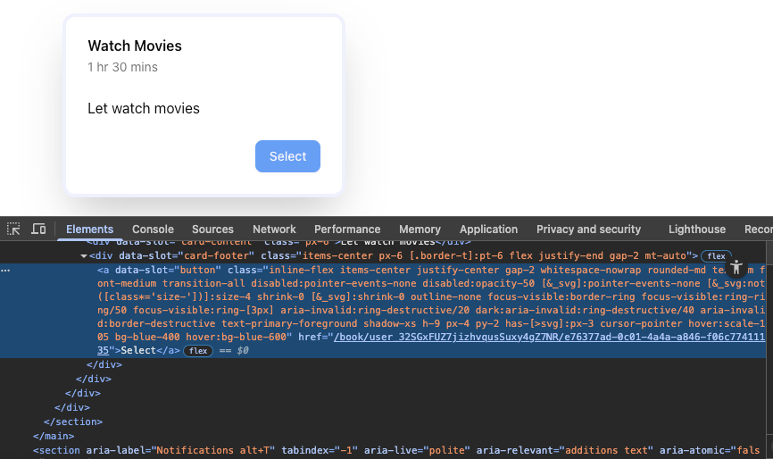
  </a>
</div>

`Next`

- `revalidatePath` - is a `Server Functions` that lets you invalidate cached data of a specific path. And make it fetch data again next time it is requested.

`Clerk`

- is an `Authentication middleware` that is similar to `Auth.js`. It gives you pre-built UI components for user authentication and functions to handle authentication with just a small amount of code in `middleware.ts`. And if you want to use multiple providers for login or customizing related to User information and Authentication, you can do it on their `dashboard` without coding. For `Auth.js`, you need to add it to the `provider` option or find related options and handle those in `middleware.ts`. But `Clerk` is only `free` if you have less than `10,000 MAU`(Monthly Active Users).

`zod`

- `superRefine` - is a `method` similar to `refine`, which lets you add additional validation logic to a schema. But can return multiple issues("error messages") at once.

`React Hook Form`

- `useFieldArray` - is a custom `hook` for an array field or field in `form` that can have multiple values/items. So it will give you methods to manage that field (e.g., `append`, `remove` methods to add or remove `availability` items in the schedule form). You can see more in [docs](https://react-hook-form.com/docs/usefieldarray)

`Github`

- To merge the latest (n) commits into one commit and push( e.g., 22 commits for my case)

```js
git reset --soft HEAD~22
git commit
git push --force-with-lease origin <branch-name>
```

- This happened since I need to debug the timezone issue on Vercel, so I pushed code many times and made my repo have unnecessary commit history. So I want to merge the latest (n) commits into one commit instead. And there are many ways to do it. You can see more in https://stackoverflow.com/questions/5189560/how-do-i-squash-my-last-n-commits-together

<div>
  <a href="">
    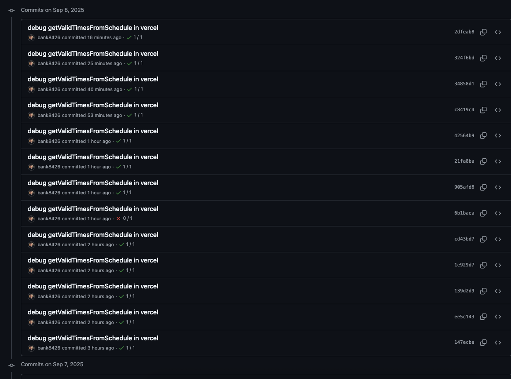
  </a>
</div>

## <a name="implementation-note">Implementation Notes</a>

- `Next`

  - Error `NEXT_REDIRECT` when calling `redirect()` in `try/catch/finally` block of `Server Actions`
    - This error happens because it's something that should not be done since the `behavior` of the `redirect` function is to throw a `Next.js error code` that will be caught by `Next.js`, and it will handle the redirect for us. (see more in [docs](https://nextjs.org/docs/app/api-reference/functions/redirect#behavior))
    - There are 2 ways to resolve this issue
      1. On `Server Actions`, call `redirect` outside the `try/catch/finally` block
      2. On `Client Components`, use the `useRouter` hook and call `router.push(<path>)` to redirect instead after the `Server Action` completes ( We use this method )

- `regex`

  - Incorrect regex in Time format of `HH:MM`(Should be `mm` for `minute`) for availabilities in `scheduleFormSchema` since we try to validate time format to have leading zero with regex `/^([0-9]|0[0-9]|1[0-9]|2[0-3]):[0-5][0-9]$/`

  <div>
    <a href="">
      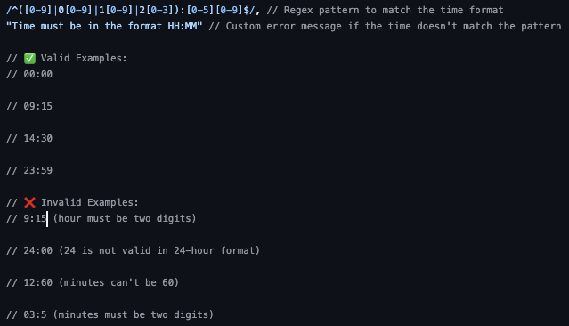
    </a>
  </div>

  - But if we test that regex with `9:15`, it will pass, which is incorrect based on the code comment. This happens because of first `[0-9]|` makes a one-digit `hour` to pass.

  <div>
    <a href="">
      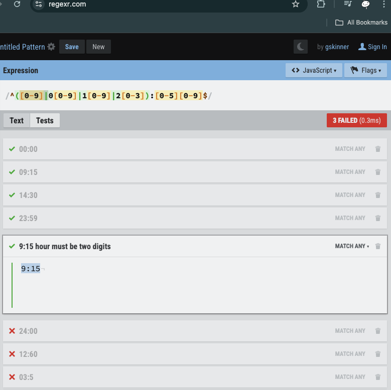
    </a>
  </div>

  - But as the default value of `Availability.startTime` in `ScheduleForm` is `9:00`, which contradicts what is planned to validate. But I think it is easier for users to input hours without leading zero. So I left it as it is and just updated the error message.

  ```js
  z.object({
    dayOfWeek: z.enum(DAYS_OF_WEEK_IN_ORDER),
    startTime: z
      .string()
      .regex(
        /^([0-9]|0[0-9]|1[0-9]|2[0-3]):[0-5][0-9]$/,
        "Time must be in the format H:mm or HH:mm"
      ),
    endTime: z
      .string()
      .regex(
        /^([0-9]|0[0-9]|1[0-9]|2[0-3]):[0-5][0-9]$/,
        "Time must be in the format H:mm or HH:mm"
      ),
  });
  ```

- Timezone `issue#1` on Vercel

  - When I test on my local, it works as expected. But when I deployed on Vercel, I got an exception error `Selected time is not valid` in `Vercel's Logs`, which means that somehow the user 's input `startTime` is not available anymore, even though the form allows the user to select it, and there are no conflict events in Google Calendar. I know it's about the timezone for sure, but it still takes a while to debug where the issue comes from.
  <div>
    <a href="">
      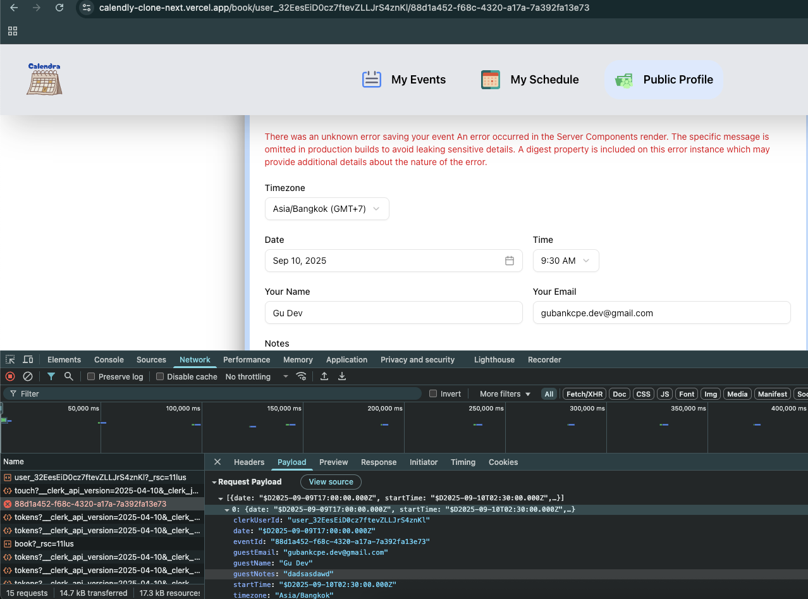
    </a>
  </div>

  - When I debugged, I found that `startTime` does not match with `availabilities` in `schedule` because it got parsed into `different` date. So I try to parse it back, as you can see in `zoneDate` in the image below, which gives the same date as `startTime`, but it still does not match with `availabilities` in `schedule`.

  <div>
    <a href="">
      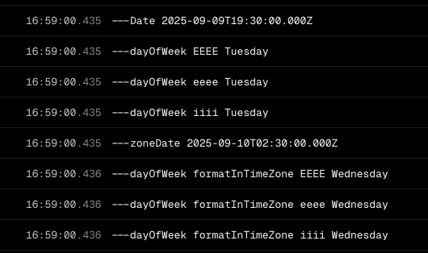
    </a>
  </div>

  - But in the end, I found that it happened because we tried to `convert UTC date to UTC date again` on `startTime` in `createMeeting`. And try to reconvert it back in `getAvailabilities`. Since `startTime` is already in UTC date, we should not convert it again. How do you know it is a `UTC date`? You can check it in date format, which is `YYYY-MM-DDTHH:mm:ss.sssZ` as `T` in middle and `Z` at the end without timezone offset.

  <div>
    <a href="">
      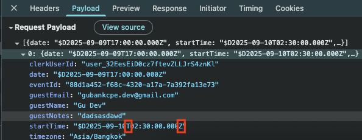
    </a>
  </div>

  - So this issue is caused by the miss conversion of `startTime` in 2 functions, which are `createMeeting` and `getAvailabilities`. You can see the full code commit in https://github.com/bank8426/calendly-clone-next/commit/6eebea5f1572dc34fdebc1fafebbddb8eb9998df

  - For summary

    1. `createMeeting` - `don't need` to convert `startTime` to UTC date since it already is. Google Calendar also uses `UTC date`. Convert it again, cause Google Calendar books the event with the wrong time too.

    <div>
      <a href="">
        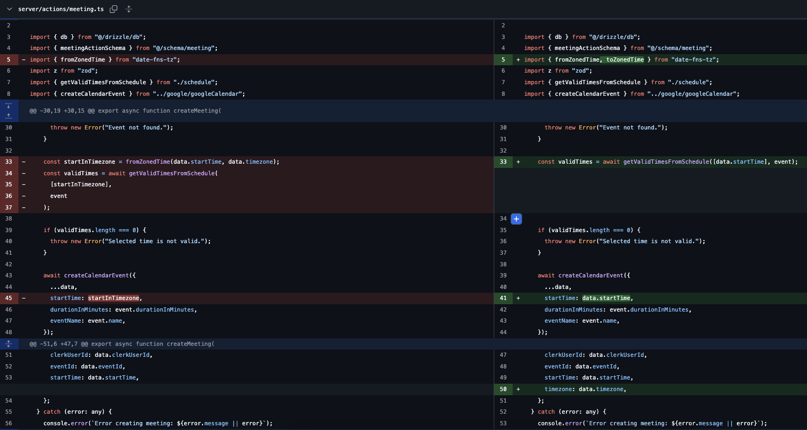
      </a>
    </div>

    2. `getAvailabilities` - `need` to convert `startTime` to `availability schedule owner timezone` to be able to compare it with `availabilities` in `schedule`. And then convert the calculated result back to `UTC date`.

    <div>
      <a href="">
        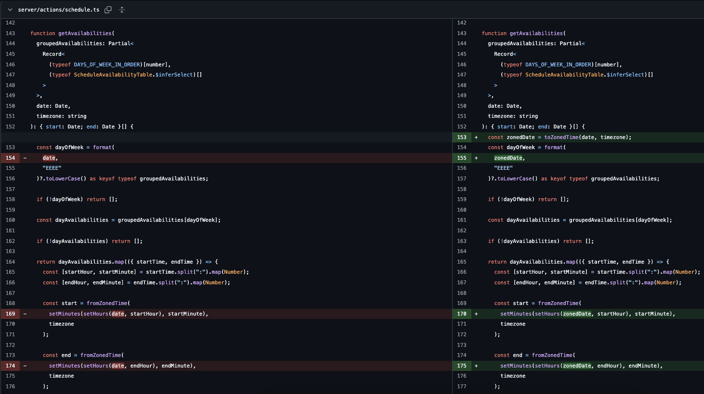
      </a>
    </div>

- Timezone `issue#2` on Vercel

  - This issue is about the datetime that is displayed on the success page after booking the event. As you can see on the left, it displays `2:00 AM` based on server timezone and time format as `short` in `lib/formatter.ts`, which is weird since I input `startTime` with `9:00`.
  <div>
    <a href="">
      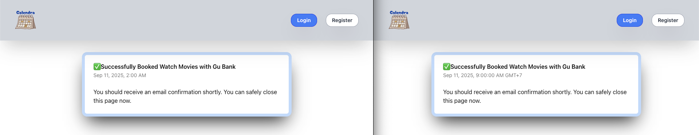
    </a>
  </div>

```js
const dateTimeFormatter = new Intl.DateTimeFormat(undefined, {
  dateStyle: "medium",
  timeStyle: "short",
});

export function formatDateTime(date: Date) {
  return dateTimeFormatter.format(date);
}
```

- So to fix this issue, I changed `timeStyle` to `long` in `lib/formatter.ts` and made it to receive `timezone` as a parameter to be able to format datetime following the timezone and merged the code with `dateTimeFormatter`, which is unnecessarily split into another function, making it hard to modify, and it's only use once. Other than that, I need to pass `timezone` to the `formatDateTime` function, which will involve returning `timezone` from `createMeeting` Server Action and passing it through `params` to `formatDateTime` function in `SuccessPage`. This is also in the same commit as above https://github.com/bank8426/calendly-clone-next/commit/6eebea5f1572dc34fdebc1fafebbddb8eb9998df. And that will give the result as in the image above on the right. There is also unnecessary split code to function in `formatTimeString` and `formatDate`, but I left it as it is.

```js
export function formatDateTime(date: Date, timezone: string) {
  const dateTimeFormatter = new Intl.DateTimeFormat(undefined, {
    dateStyle: "medium",
    timeStyle: "long",
    timeZone: timezone,
  });

  return dateTimeFormatter.format(date);
}
```

<div>
  <a href="">
    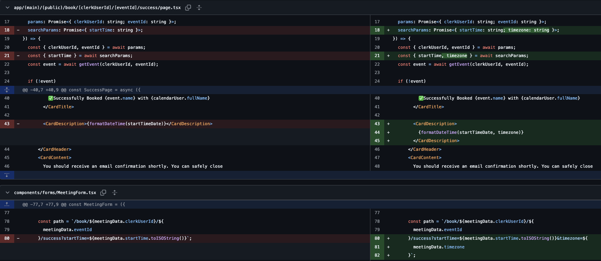
  </a>
</div>

- `dayOfWeek()`

  - This function is to compare and get the day of the week in string format using `isMonday, isTuesday, ..., isSunday` functions in the `date-fns` library. Since inside those functions, they will `format` the date, then call `getDay()` to get the day of the week in number(0-6), and then do comparison, which is fine if you check only a few days of the week. As code below, if `input date` is `Sunday`, it needs to go through the process `7 times` to get the expected result.
   <div>
    <a href="">
      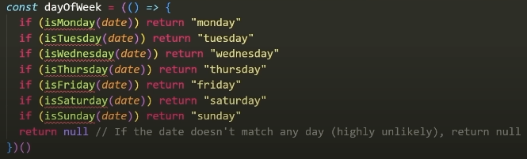
    </a>
  </div>

  - So I changed it to `format` date one time with `EEEE` to get a certain day of week in string format, make it lowercase, then cast it with `as keyof typeof groupedAvailabilities` to match the type of `index` used for `groupedAvailabilities` instead.

```js
function getAvailabilities(
  groupedAvailabilities: Partial<
    Record<
      (typeof DAYS_OF_WEEK_IN_ORDER)[number],
      (typeof ScheduleAvailabilityTable.$inferSelect)[]
    >
  >,
  date: Date,
  timezone: string
): { start: Date; end: Date }[] {
  const zonedDate = toZonedTime(date, timezone);
  const dayOfWeek = format(
    zonedDate,
    "EEEE"
  )?.toLowerCase() as keyof typeof groupedAvailabilities;

  if (!dayOfWeek) return [];

  const dayAvailabilities = groupedAvailabilities[dayOfWeek];
  ... // the rest of the function
}
```

- `Deprecation issues` since I use the latest version of every package

  - Zod v4

    - Email field

    ```js
    z.string().email(); //❌deprecated
    z.email(); //✅recommended
    ```

    - Merge schema

    ```js
    // .merge() (❌deprecated)
    z.object(schemaA).merge(schemaB);
    // .extend(schemaB.shape) (✅recommended and don't forget `.shape`)
    z.object(schemaA).extend(schemaB.shape);
    ```

  - Shadcn

    - `Calendar` component

    ```js
    <Calendar
      initialFocus //❌deprecated
      autoFocus //✅recommended
      ... //other props
    />
    ```
